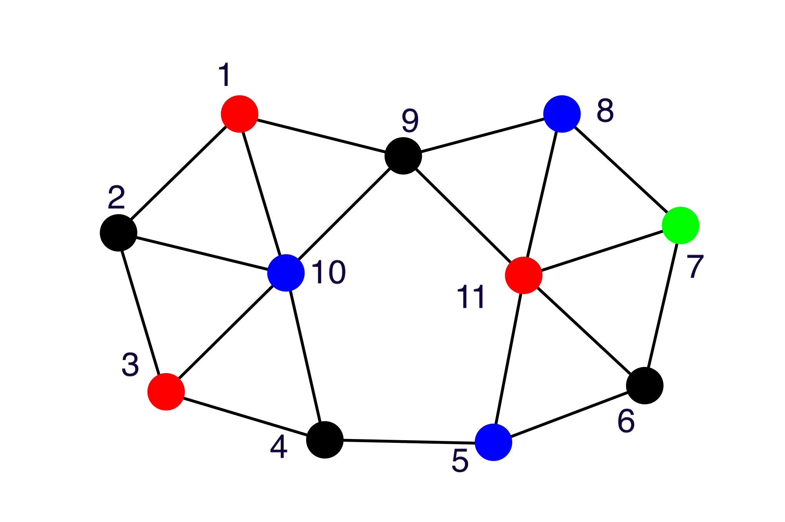
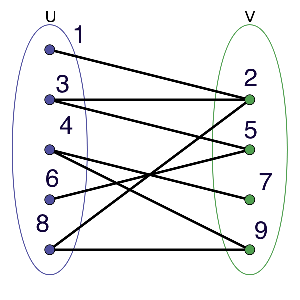
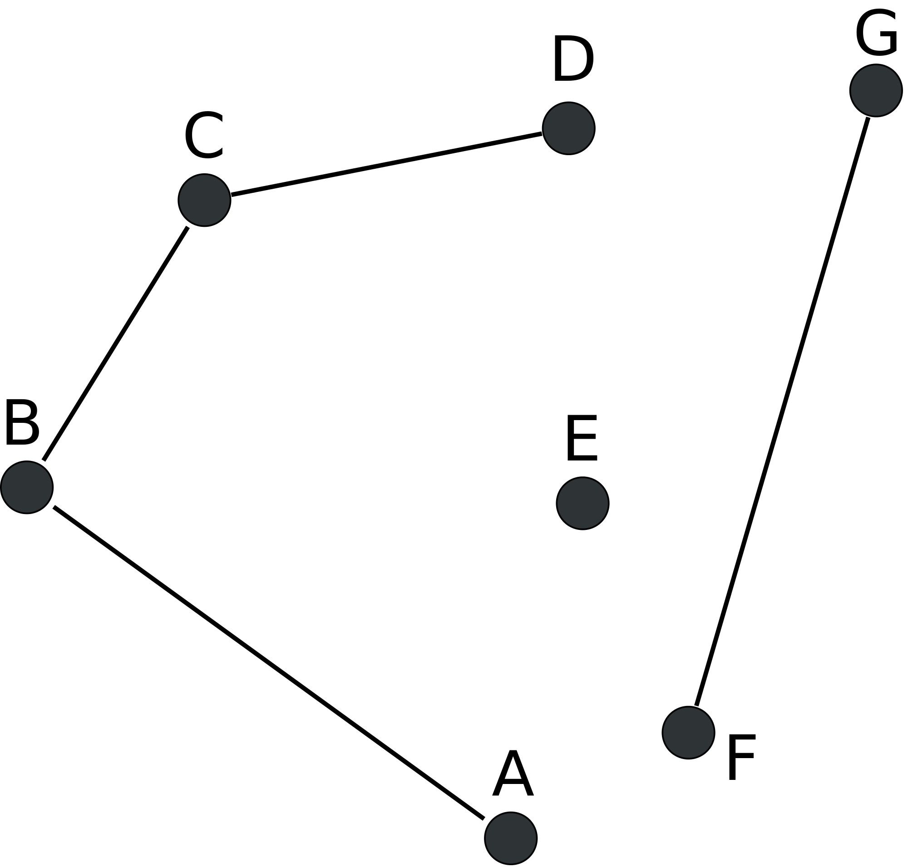

# CS 107 Project 3 -- Graphs, Colors, and Paths

For this project, you will be implementing a variety of algorithms
that deal with graph colorability. A graph is a data structure
consisting of nodes and edges. Here's a picture of a graph:

Each of the little circles is a *node* (other people will sometimes
call these *vertices*), and each one of the lines is an *edge*. Each
node has a label (an integer ID, in this case), along with a
*color*. Graphs don't have to have colors, but in this assignment
we'll study several properties of graph colorings.

Technically, the set of graphs can be thought in a few different
ways. For this project, I'm going to use the adjacency-list
representation:

    Graph ⊆ ℘(Node) × ℘(Edge)
    Node ≡ ℕ
    Edge ≡ Node × Node

In other words, a graph is a pair of a set of nodes and a set of
edges. A node is just a number, and an edge is a pair of nodes. The
reason this is called the adjancy-list representation is that we
represent edges as a list of pairs of nodes that are adjacent to one
another in the graph. We'll observe other implementations later on,
for example, we can also represent edges as matrices, which will speed
up some operations on graphs by taking advantage of our computer's
ability to quickly multiply matrices.

### Tuples in Python

[Tuples](https://en.wikipedia.org/wiki/Tuple) generalize pairs, and
can be written in Python using syntax akin to that of ordered pairs
from our algebra classes:

    (1,2)
    (1,2,3)
    (1,2,3,4)

They can be indexed in the same way that Python lists / arrays are
indexed:

    >>> (1,2,3)[1]
    2

## Graphs in Python

A graph is a mathematical construct, but when we choose to implement
it in Python, there are a rich variety of ways that we can choose to
implement the graph. In this assignment, we'll stick to the natural
representation that you would come up with from the definition above:
a graph is a pair (two-tuple) of a list of nodes and a list of edges.

So, for example, a sample graph looks like this:

    g1 = ([1,2], [(1,1), (2,2), (1,2)])

In this assignment, we will be working with *undirected* graphs,
meaning that if there is an edge from node `1` to node `2` (as in the
above example), there is also an edge from node `2` to node `1`.

#### Tasks 1 & 2: `isNeighbor` and `getNeighbors`

We say that two nodes `n₁` and `n₂` are *neighbors* if there is an
edge between `n₁` and `n₂`.

You will write two functions: `isNeighbor` and `getNeighbors`:

- (5 points) The `isNeighbor(g,n1,n2)` function will return `True` if
  and only if nodes `n1` and `n2` are neighbors in graph `g`. This
  function must consider the fact that the graphs are undirected. For
  example, `isNeighbor(g1, 2, 1)` should return `True`.

- (5 points) The function `getNeighbors(g,n)` will return a list
  representing the set of immediate neighbors for a given node. For a
  given node `n₁`, this is the set of nodes `⎨ n₂ ∣ n₂ ∈ g ∧
  isNeighbor(g, n₁, n₂) == True⎬`. For example `getNeighbors(g1,1)`
  should return `[1,2]`.

### Graph Coloring

A graph coloring is an assignment of a "color" to each node. For
example, in the above graph, node 1 has been assigned the color red,
and node 10 has been colored blue. We will represent colors as strings
in Python. We will represent colorings as lists of pairs, where the
first element of the pair is the node number, and the second element
is a string representing the color.

    [(1, "red"), (2, "blue")]

I am going to say that a coloring is "consistent" for a graph, `g`,
when the coloring:

  - Includes *exactly one* coloring for each node in the graph
  - Includes no nodes not in the graph

For example, for the above graph, a coloring including
`[...,(1,"red"), (1,"blue")]` would not be consistent because the
coloring included both red and blue colors for node 1.

Colorings assign colors to each node in the graph. A coloring is
"valid" if no two adjacent nodes have the same color. Back in 1852,
someone realized that when you were coloring a map (say of Europe),
you only needed four colors. This is known as the [four color
theorem](https://en.wikipedia.org/wiki/Four_color_theorem). This
result holds holds for a certain class of graphs that represent maps
we can draw in two dimensions (the so-called "planar" graphs).

We say that a graph is **k-colorable** whenever it has some valid
coloring with at most `k` colors. Deciding whether or not a graph is
k-colorable is a very hard problem to solve: there is no known
algorithm that can do so efficiently (we will talk about what this
means towards the end of the course). However, deciding if a specific
coloring is valid is much easier.

Conceptually, checking whether a coloring is valid involves walking
through each node of the graph `n`, looking up the color of `n`'s
neighbors, and checking that none is the same as the color of
`n`. This is a problem we can tackle with recursive design.

#### Task 3: `numColors`

- (5 points) Write a function, `numColors(coloring)`, and tells you
  the number of colors present in `coloring`. For example,
  `numColors([(1,"red"),(2,"blue")])` must return `2`.

#### Task 4: `isConsistent`

- (5 points) Write a function, `isConsistent(g, coloring)`, that takes
  a graph `g`, and a coloring, and decides whether or not the coloring
  is valid for the graph.

#### Task 5: `isValidColoring(g,coloring)`

- (10 points) Write a function, `isValidColoring(g,coloring)` that
  decides if coloring `coloring` is valid for graph `g`. Specifically,
  your function must return `True` when, for every node `n ∈ g`, all
  nodes `⎨ n₁ ∈ g ∣ isNeighbor(g,n,n₁) ⎬` have a different color than
  `n`.

#### Non-task: `isValidKColoring(g, coloring, k)`

- I have defined this for you in terms of the other functions

## Checking If a Graph is Bipartite

As is typical in computer science, while we can't solve coloring in
general, we *can* solve it in a restricted case. We say that a graph
is *bipartite* when it is 2-colorable. A picture always helps me to
understand this better:

In this graph, you can see how we can divide the nodes in the graph
into two categories. We can check whether or not a graph is bipartite
by using a recursive strategy that I'm going to call the "frontier
strategy." Here's how it works: in our algorithm, we're going to
maintain two sets of nodes `A`, and `B``. To start the process, we
pick an arbitrary node. It can be any node, it doesn't matter
which. For this graph, let's pick node `1`. Then, we throw that node
in the set `A` (we could pick set `B`, the reasoning is symmetric):

    A = ⎨ 1 ⎬, B = ∅

Now, we look at all of node 1's neighbors and add them to the set
`B`. In this case we get:

    A = ⎨ 1 ⎬, B = ⎨ 2 ⎬

Now what we do is take everything in set `B` and try to add all the
neighbors (to those in set `B`) neighbors to `A`. In this case, the
only thing in `B` is the number `2`, so we add it's neighbors to `A`:
`1` is already in `A`, so we only need to add `3` and `8`:

    A = ⎨ 1, 3, 8 ⎬, B = ⎨ 2 ⎬

Now, we swap. We take everything in `A`, and add its neighbors to
`B`. This time, we end up with with:

    A = ⎨ 1, 3, 8 ⎬, B = ⎨ 2, 5, 9 ⎬

We can keep going whenever the sets *change* after adding something to
them. In other words, if we had explored set `A`, and nothing had been
added to set `B`, we would know there coule be nothing else we could
do, since we'd already looked at everything in set `B`. We only need
to "keep going" when we add new things to explore.

In our example here, we need to keep going, so let's add all of `B`'s
neighbors to `A`:

    A = ⎨ 1, 3, 8, 4, 6 ⎬, B = ⎨ 2, 5, 9 ⎬

Can we keep going? Yes, because `A` has changed, so there's
potentially more stuff to look at. If we do this process again we find
that we can add `7` to B: 

    A = ⎨ 1, 3, 8, 4, 6 ⎬, B = ⎨ 2, 5, 9, 7 ⎬

Can we keep going? Yes, because we just found this new node `7` to
explore. Let's do it again and all of `B`'s neighbors to `A`:

    A = ⎨ 1, 3, 8, 4, 6 ⎬, B = ⎨ 2, 5, 9, 7 ⎬

Finally, something stable. We can't explore the graph any more, since
we've already looked at everything in `A` now.

The trick here is that we were able to follow the following algorithm:
  - Put all of the neighbors of anything in `B` in set `A`
  - Check to see if `B` has changed
    - If it has, swap the sets `A` and `B` and perform this process again
    - If it has not we are done

Now, previously I said that we could use this strategy to check
whether or not a graph is bipartite. So how do we do that? The answer
is pretty clean and clever: we run this procedure to completion, and
then we check to see whether the graphs contain any common
elements. If they do, the graph is **not** bipartite. If they don't,
the graph **is** bipartite. Proving this works for any graph is a bit
tricky, so we won't do it here, but the reasoning is based on
induction over the set of nodes in the graph.

To convince ourselves of how it works on a non-bipartite graph, let's
run this process on the following graph:

    ([1,2,3], [(1,2), (2,3), (1,3)])

This graph can't be 2-colored. If we pick `1` to be red and `2, 3` to
be blue, it doesn't work (edge from `2` to `3`).

Let's see how our algorithm works on this graph. We can pick any node
to start with, but let's pick the first one in the list just for
clarity:

    A = ⎨ 1 ⎬, B = ∅

Now we calculate all of `A`'s neighbors and put them in `B`:

    A = ⎨ 1 ⎬, B = ⎨ 2, 3 ⎬ 

B changed, so we know we can keep going. So now we put all of `B`'s
neighbors in `A`:

    A = ⎨ 1, 2, 3 ⎬, B = ⎨ 2, 3 ⎬

Uh oh, we see the problem: `A` and `B` are overlapping. But we can
keep going, since we just updated `A`. So let's add all of `A`'s
neighbors to `B`.

    A = ⎨ 1, 2, 3 ⎬, B = ⎨ 2, 3, 1 ⎬
    
And we can still keep going, because we just added `1` to `B`
(remember, we keep going until the exploration phase produces nothing
new). Our next phase produces nothing interesting, since we already
have the answer:

    A = ⎨ 1, 2, 3 ⎬, B = ⎨ 2, 3, 1 ⎬

However, we can now see the problem: the sets `A` and `B` (completely)
overlap. I invite you to try this process out on the big graph at the
start of this project: it is also not bipartite and you should get
similar results.

#### A Note on Connectedness

The process I've outlined here works for "connected" graphs, where
every node is reachable by some path from every other node. There are
also *unconnected* graphs, where some nodes are not reachable from
others. Here's an example:

You can see that the node `A` is not connected at all to `E`: there's
no way you can start at `A` and follow a path to `E`.

If you try the algorithm I've outlined above on unconnected graphs,
you'll see that it gets stuck. For example, in the above graph, if you
start with (excuse the confusing overloading of `A` and `A` please):

    A = ⎨ A ⎬, B = ∅

You'll eventually end up calculating:

    A = ⎨ A, C ⎬, B = ⎨ B, D ⎬

But you'll never be able to add `E, F, G` to the sets. There is a
relatively straightforward fix to this: once you reach "the end" of
the process, you can simply start over with any arbitrary new element
(outside of the sets `A` and `B`) and continue. For example, from this
"stabilized" set, you could pick `E` and add it to `A`, then
continue. Then, once that reaches the end, you could `F`. The key is
that you have to add a new element not already in any of the sets.

Implementing this is extra credit for this project

### Implementing Bipartite Checking for Connected Graphs

To implement bipartite graph checking, I'm going to guide you through
the process. One bit of trickiness is that so far, I've been talking
about *sets*, rather than lists. In this assignment, we're going to
treat lists as sets, so we'll have to implement things like set union,
intersection, and equality to respect the fact that we need to
maintain the set invariant: any element in the set must appear at most
once.

I have implemented the `setUnion` and `setIntersection` functions,
which take two lists `lst1` and `lst2` (assuming they have the
property that no element repeats itself) and perform unions and
intersection on them.

#### Task 6: `setEquals`

- (5 points) Implement `setEquals`, which compares two lists (regarded
  as sets) for equality. The trick here is that sets can be reordered
  in any way, for example, `setEquals([1, 2], [2, 1])` should return
  `True`.

#### Task 7: `calculateNextSet`

- (10 points) Implement the function `calculateNextSet(A,B)`. This
  function takes two inputs: a set `A` to explore, and a set `B`. The
  output of this function is the union of the set `B` with the
  neighbors of everything in the set `A`. This function is playing one
  "round" of the process from the above example.

#### Non-task: `iterateFrontier`, `start`, and `calculateBipartite`

Using these two functions, I have implemented the rest of the
algorithm. The idea roughly follows that which I have outlined: it
starts by picking the first node in the graph and putting it in the
`A` set, then iterates the process until nothing new is produced
(measured by `setEquals`), and then calculates whether the
intersection is empty.

If you did the individual parts right, this should just work!

#### Extra credit (2 points): Bipartite Checking for Unconnected Graphs

For extra credit, extend `calculateBipartite` to work with unconnected
graphs. Be sure to write tests that demonstrate it really works.

## Grading and Rubric

I have given you a basic set of tests, included in the
testsuite. These are the "public" tests. I am specifically witholding
a set of "private" tests: larger examples with edge cases not included
in the public tests. The public tests I've given you are enough for
you to get the high-level idea, but likely won't test as much behavior
as my secret tests will. When we grade your assignment, we will give
points for both the public and the secret tests.

I will also be grading on *style* (10 points) using the following Rubric:

- Extremely poor (2/10): No code comments, no preconditions specified,
  uses constructs we haven't talked about in class (ask if in doubt,
  but no loops or variable mutation), not extra tests.

- Poor (4/10): Only minor comments, no thought into preconditions at
  all. No (or almost no) extra tests or only superficially different
  tests.

- Fair (6/10): Occasional comments, precondition / postconditions with
  at least a little thought, at least one good extra test.

- Good (8/10): Most non-trivial functions have tests and pre/post
  conditions.

- Great (10/10): Essentially all non-trivial functions have throughful
  comments, pre/post conditions that make sense and give the right
  amount of detail, and all functions have extra tests.

#### Rubric

- Task 1 (5 points):
    - Public tests: X/2
    - Secret tests: X/3
- Task 2 (5 points):
    - Public tests: X/2
    - Secret tests: X/3
- Task 3 (5 points):
    - Public tests: X/2
    - Secret tests: X/3
- Task 4 (5 points):
    - Public tests: X/2
    - Secret tests: X/3
- Task 5 (10 points):
    - Public tests: X/4
    - Secret tests: X/6
- Task 6 (5 points):
    - Public tests: X/2
    - Secret tests: X/3
- Task 7 (10 points):
    - Public tests: X/4
    - Secret tests: X/6
- Extra credit: X/+2
- Style: X/10 (Follows style rubric above)

